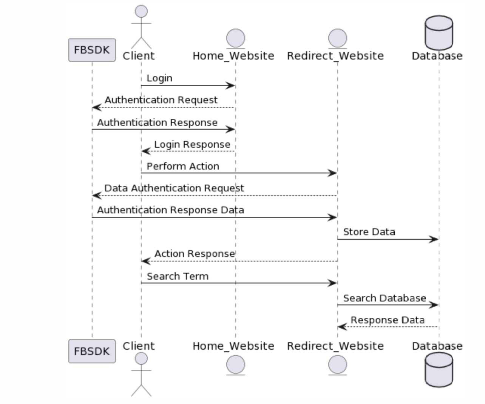

Design Patterns
==============================
This document will describe the Creational, Behavioral, and Structual design patterns that will be considered and/or used for this project.

## Creational
 - - - - - - - -
  ### Currently in Use
  We are currently using a Factory pattern to access user data from the Facebook SDK. The objects are already instantiated and they are just requesting access to it. We are also using parts from the abstract factory pattern where we can define functions abstractly for different products that are related.
    
  ### Possible Uses
  
  We might be using parts of a BUILD pattern because we will have complex objects with id's that are needed to access content via the Facebook SDK.

## Behavioral
- - - - - - - -
  ### Currently in Use
  We are currently using the command pattern. The client sends the command and the receiver is the website that they are redirected to.
  
  ### Possible Uses
  A possible pattern we will be implementing when we create the database for the comments is the iterative pattern. We will have to iterate throught the list of comments created from the database.

## Structural
- - - - - - - - -
  ### Currently in Use
  We have yet to use any structural patterns yet, but we will be implementing these in the possible uses.
  ### Possible Uses
  

  
- - - - - - - - -
# Notes

The patterns in Possible Uses are being considered for implementation

## UML Diagram of Web Application

